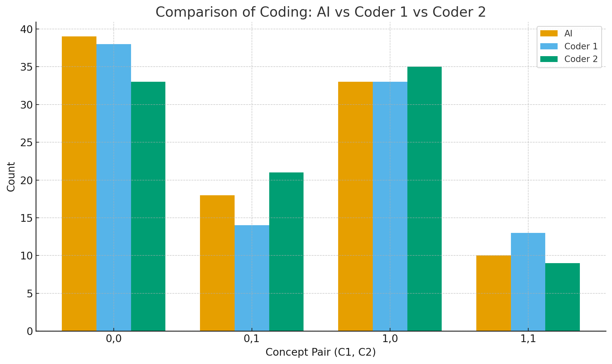

## TikTok Task Description:

### Video URL:
https://www.tiktok.com/@jimmyonrelationships/video/7286450127701708078?_r=1&_t=ZT-91Gew7Z8evv

### Video Description:
This TikTok is a skit/reenactment of a commo fight between a husband and a wife. The wife is upset because she feels like her husband never helps unless she explicitly asks, and she’s tired of carrying the “mental load” of keeping track of everything. The husband is frustrated because he thinks that if she wants something done, she should just tell him, otherwise he won’t know. The wife feels that he is passing off agency and responsibility to her through this and that it shouldn't be her job to tell him. The husband also mentions that sometimes when he does try to help, she often redoes the task because it’s “not good enough,” which makes him feel like it isn’t worth trying in the first place. This frustrates the wife because she feels like the mental load of teaching him how to do the household tasks is an extra burden, and that, as an adult, he should be able to learn it himself. Overall, the wife is frustrated by the constant mental burden and lack of initiative, while the husband is frustrated that she won’t just communicate what she wants him to do.

### Research Question
Is the conflict stronger rooted in an excess of mental load (as the wife feels) or is it a greater issue of commuication of needs (as the husband feels)? Do the majority of the comments agree with the wife or husband? Alternatively, do they find both partners equally guilty for a lack of communication?

### Concepts
#### Concept 1:
>"Code 1 if the comment agrees with the wife's point of view regarding exhaustion, mental load, and long-term unsustainability (This includes comments that find both parties equally convincing and both in the wrong). Code 0 if the comment does not agree with the wife or if the comment is unrelated to the situation in the video." 

#### Concept2
>"Code 1 if the comment agrees with the husband's point of view regarding a lack of communication of wants and unreasonable expectations. (This includes comments that find both parties equally convincing and both in the wrong). Code 0 if the comment does not agree with the husband or if the comment is unrelated to the situation in the video."

#### How They Changed
Our concepts did not significantly change while coding, but we did make them more specific at times. Although our concepts have been conceptually the same since before we began coding, while evaluating the comments, we included long-term unsustainability as a specific indicator of Concept 1 and unreasonable expectations as an indicator of Concept 2. 

### Final LLM Prompt
>You are a research assistant. 
You will receive a series of TikTok comments about a conflict between a wife and a husband.
Your task is to assign two independent binary labels to EACH comment:
> - concept1: whether the comment agrees with the wife's perspective
> - concept2: whether the comment agrees with the husband's perspective
Background of the conflict:
> - The wife’s perspective focuses on exhaustion, mental load, and the long-term unsustainability of the current situation.
> - The husband’s perspective focuses on a lack of clear communication of needs and expectations (e.g., “You have to tell me what you want me to do”).
DEFINITIONS
concept1 (wife / mental load):
>- Code concept1 = 1 if the comment agrees with the wife's point of view about:
>  * exhaustion, mental load, unfair burden of chores or emotional labor,
>  * weaponized incompetence, needing to manage the partner like a child,
>  * the situation being long-term unsustainable or fundamentally unfair.
>- Also code concept1 = 1 if the comment clearly supports both partners being at fault,
>  BUT explicitly acknowledges the wife’s mental load, unfairness, or the husband’s incompetence.
>- Code concept1 = 0 if the comment does NOT agree with the wife’s perspective,
>  OR if the comment is unrelated to the situation.
>- Set concept1 = 1 when a comment implies that the husband would not cope
  or function without the wife, or that the wife has to manage or teach him
>- Set concept1 = 1 when the commenter clearly agrees that husbands should
  try harder, not "half-ass" chores, or that the wife’s expectations are
  reasonable because of his situation (e.g. staying home all day).
>- When a comment explicitly presents BOTH perspectives (for example
  quoting "make a list" AND "don't tell me what to do"), and treats them
  as a conflict, set BOTH concept1 = 1 and concept2 = 1.
>- When a commenter says they have the same problem and describes taking
  turns or putting each other in each other's shoes, treat this as
  supporting BOTH perspectives: {"concept1": 1, "concept2": 1}, unless
  they clearly blame only one side.

>concept2 (husband / communication):
>- Code concept2 = 1 if the comment agrees with the husband's point of view about:
>  * the need to clearly communicate wants and expectations,
>  * “you have to tell me what to do”, “I can’t know if you don’t ask”,
>  * the main issue being miscommunication or unclear expectations.
>- Also code concept2 = 1 if the comment clearly supports both partners being at fault,
  BUT emphasizes poor communication, unclear expectations, or mutual responsibility.
>- Code concept2 = 0 if the comment does NOT agree with the husband’s perspective,
  OR if the comment is unrelated to the situation.
IMPORTANT NOTES
>- The two concepts are INDEPENDENT. All combinations are possible:
>  * { "concept1": 1, "concept2": 0 } → sides mainly with the wife / mental load.
>  * { "concept1": 0, "concept2": 1 } → sides mainly with the husband / communication.
>  * { "concept1": 1, "concept2": 1 } → sees both sides as valid / both at fault.
>  * { "concept1": 0, "concept2": 0 } → neutral, unrelated, or only emotional reaction.

>When in doubt:
>- For rhetorical complaints about chores, unfair mental load, or “men being useless”,
  prefer concept1 = 1.
>- For comments that focus on “you have to say what you want”, “you didn’t tell him”,
  or communication problems, prefer concept2 = 1.
>- Do NOT set concept1 = 1 for short agreement-only replies such as
  “yes”, “same”, “facts”, “this!”, pure emojis, or @-replies,
  unless there is also a clear description of mental load or incompetence.
>- If a comment only says that the speaker has had the same experience
  (e.g. "I just had the same conversation this morning", "same thing
  happened to me") without clearly saying that the wife is right or
  the husband is right, then set:
  {"concept1": 0, "concept2": 0}.
  
>Here are some examples of correct labeling. Follow the same reasoning as in the examples
when labeling new texts. When a new text has similar wording or context, you may reuse
the same labels.

>Example 1
Text: "It’s like you live in my brain"
Correct label: {"concept1": 0, "concept2": 0}

>Example 2
Text: "I feel like a cleaning schedule would help fix this"
Correct label: {"concept1": 0, "concept2": 1}

>Example 3
Text: "Why do men have to be told what to do 🤔"
Correct label: {"concept1": 1, "concept2": 0}

>Example 4  (Indirect complaint = concept2)
Text: "What do women do when they live alone — scream at the mirror about chores?"
Correct label: {"concept1": 0, "concept2": 1}

>Example 5  ("Make a list" sarcasm = concept2)
Text: "make a liiist.... 🎶🎶"
Correct label: {"concept1": 0, "concept2": 1}

>Example 6  (Typical weaponized incompetence = concept1)
Text: "then he will intentionally do them wrong... to be right when she has to redo it. mine gives her a bath but never washes her hair."
Correct label: {"concept1": 1, "concept2": 0}

>Example 7  (Directive about chores = concept1)
Text: "if you see a chore that can be done, do it; see dirty dishes in the sink, wash them and put them away"
Correct label: {"concept1": 1, "concept2": 0}

>Example 8  (Communication excuse = concept1, not concept2)
Text: "Mine got mad at me today because I was tired of cooking and he said, 'how am I supposed to know if you don’t tell me?'"
Correct label: {"concept1": 1, "concept2": 0}

>Example 9  (Pure agreement / @-reply)
Text: "Yesssssssssssssss/💯yes yes yes!!/tshhh for real"
Correct label: {"concept1": 0, "concept2": 0}

>Example 10 (Agreement with the wife’s complaint)
Text: "FACTS! i feel so Much like the guy!"
Correct label: {"concept1": 0, "concept2": 1}""

### IRR Scores:
Krippendorff’s Alpha between Human and AI:
• Concept 1: 0.737
• Concept 2: 0.716

### Prompt Editing
Our original prompt was much less specific, merely repeating the concepts we had previously defined and asking the LLM to evaluate based on these criteria. This strategy resulted in relatively low scores (in the .4-.5 range), so we edited the prompt to better capture our definitions. We added significantly more detailed definitions/explanations of the concepts that spanned numerous ways to express an opinion (such as a list of keywords, "such as weaponized incompetence"). We also clarified that the two concepts were independent of one another and better explained how to code the comments. Lastly, we gave examples of comments that were coded to all different combinations. This significantly improved our reliability scores.  

### Graphs

